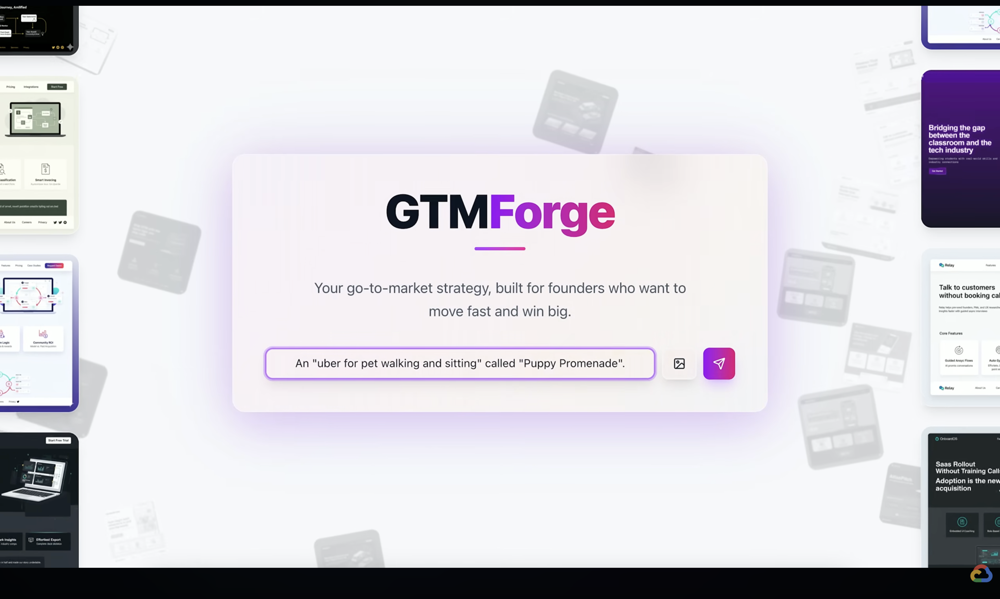
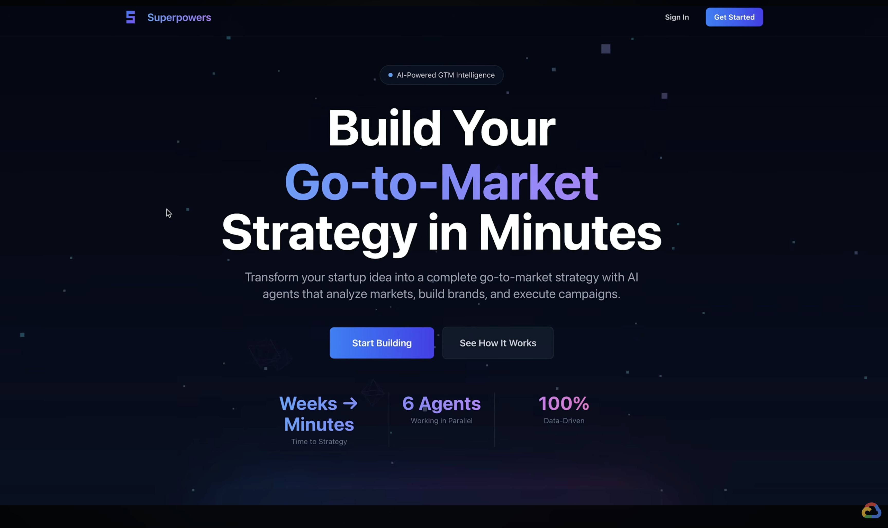
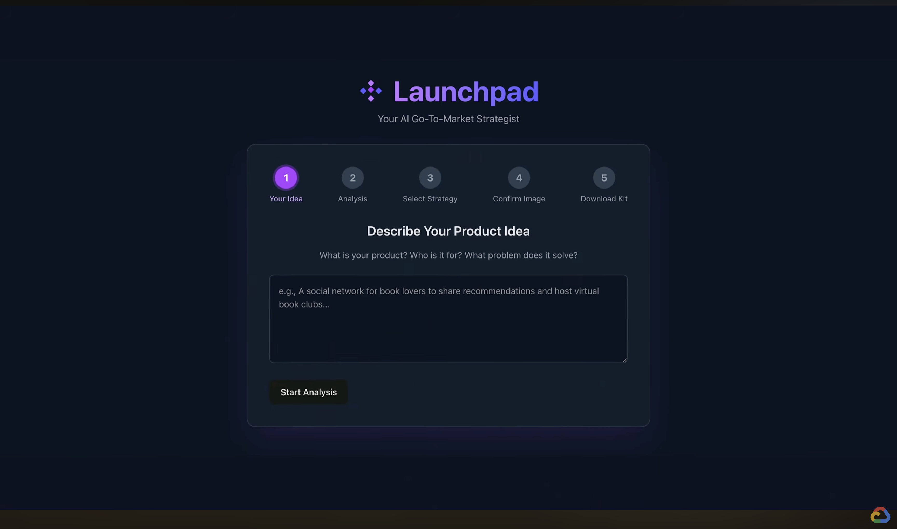

# 🍰 AI Agent Bake Off: Episode 3 Summary

Hosted by Google Cloud, this episode challenged three teams—each comprised of one external developer and one Google engineer—to build the ultimate **Go-To-Market (GTM) Agent** for startup founders.

## The Challenge
The teams were given **72 hours** to build their agents using **Gemini** and Google's **Agent Development Kit (ADK)**. From the start, we pushed them to create a **Multi-Agent and Multimodal experience** that could solve the "cold start" problem for startups—taking a raw product idea and generating strategies, assets, and traction plans.

They were tasked with supporting three distinct founder personas (detailed in [AI_Agent_BakeOff_Ep3_challenge.pdf](./AI_Agent_BakeOff_Ep3_challenge.pdf)):
*   **The Applicant (Accelerator-Bound):** An agent to craft data-driven GTM strategies specifically for competitive applications like Y Combinator.
*   **The Innovator (Early-Stage):** An agent to validate raw ideas, identify Ideal Customer Profiles (ICPs), and plan for the first 100 users.
*   **The Scaler (Growth-Stage):** An agent to diagnose "leaky buckets" and identify high-impact channels for startups hitting a growth plateau.

In addition to the main build, the teams faced a **surprise 2-hour mini-hackathon** (see [2-hour-challenge.md](./2-hour-challenge.md)) during filming. They had to pass six technical "stress tests":
1.  **Deployment:** Package and deploy the agent to a live, publicly accessible HTTPS endpoint.
2.  **Load Testing:** Maintain a success rate of 85%+ while simulating 1,000 concurrent users.
3.  **Dynamic Adaptation:** Pivot mid-task to query the BigQuery public Hacker News dataset for real-time insights.
4.  **MCP Exposure:** Expose custom internal tools as a standalone service via the Model Context Protocol (MCP).
5.  **A2A Exposure:** Wrap the agent in an Agent-to-Agent (A2A) server for cross-system collaboration.
6.  **Multimodal Reasoning:** Analyze and reason over handwritten GTM plans sketched on whiteboards.

## Team Resources: Code & Architecture

### **Daniel & Luis (GTM Forge)**

*   **Code:** [https://github.com/DanielJEfres/GTMForge](https://github.com/DanielJEfres/GTMForge)
*   **Architecture:** [tldraw Link](https://www.tldraw.com/f/Rgz7B7Tn5DUpi9P_VHf1x?d=v-783.-1809.6764.4571.pG8u-3ay57o4mE_SVCgVZ)

### **Muhammad & Ayo (Superpowers)**

*   **Code:** [https://github.com/ayoisio/ep3-agent-bake-off-startup-gtm-agents](https://github.com/ayoisio/ep3-agent-bake-off-startup-gtm-agents)
*   **Architecture:** [Figma Link](https://www.figma.com/design/E9FTXsFrtOh1ZmviXi7uKj/Agent-Bakeoff--Episode-3-?node-id=1-2&p=f&t=T31TdXqL5LSqpldj-0)

### **Zach & Laxmi (Launchpad)**

*   **Code:** [https://github.com/mzschandy/launchpad](https://github.com/mzschandy/launchpad)
*   **Architecture:** [tldraw Link](https://www.tldraw.com/f/ywDYY0KH7CzOxdAYwBc4b?d=v-2703.-948.3991.2697.N-WczzxdGlCI_6xYE3eJd)

## The Teams & Approaches

### 1. Team GTM Forge (Daniel & Luis)
*   **Concept:** A "forge" that creates everything a founder needs, including ad videos, Product Requirement Documents (PRDs), logos, and a hosted website.
*   **Architecture:** They utilized **parallel agents** to speed up processing. Instead of a sequential process taking an hour, their system ran parallel sub-agents (e.g., video creation, asset generation) to finish in about 15 minutes.
*   **Key Insight:** They utilized the **ADK web** interface for their frontend and focused heavily on reducing latency through parallelism.
*   **Judge Feedback:** The judges praised their clear presentation and the speed of the parallel architecture but noted that generating images and mockups separately caused some consistency issues.

### 2. Team Superpowers (Muhammad & Ayo)
*   **Concept:** An AI-assisted strategy builder that treats the user like a superhero, complete with an "action confirmation" gate to ensure the user approves expensive research steps before they happen.
*   **Architecture:** They built a sophisticated **multi-agent system** that manages context through **state injection**. Rather than bloating the context window by passing full conversation histories, they injected specific state variables (results from previous agents) into the instructions of subsequent agents.
*   **Key Insight:** They implemented a "shared mechanism" where sub-agents stored artifacts (like images) to a preview server using local storage, ensuring context flowed cleanly without "rot".
*   **Judge Feedback:** The judges praised the comprehensive solution and the thoughtful management of trade-offs, particularly in how they handled context and agent orchestration.

### 3. Team Launchpad (Zach & Laxmi)
*   **Concept:** A strategist for early-stage startups that generates a "Launchpad Kit" containing a validation plan, social posts, and landing page copy.
*   **Architecture:** They chose a **sequential agent pattern**. To manage context efficiently, they created a specialized "Search Agent" that acted as a **tool** shared by all other sub-agents (Product Analysis, ICP, GTM). This allowed the sub-agents to retain their own context while accessing a shared research brain.
*   **Key Insight:** Their approach proved that you don't always need a complex mesh of agents; a simple, well-structured sequential pattern can yield high-quality results.
*   **Judge Feedback:** The judges appreciated the simplicity and effectiveness of their design, noting that they didn't overcomplicate the agentic pattern.

## The Outcome
All three teams successfully tackled the complex 72-hour build and the surprise technical challenges, demonstrating the power and flexibility of the **Agent Development Kit (ADK)**. The event showcased that autonomous, multi-agent systems—capable of scaling, collaborating (A2A), and exposing tools (MCP)—are ready for real-world startup applications. The diverse architectural approaches—parallel, sequential, and state-injected—provide a rich set of patterns for the developer community to adopt.

***

## 📊 Developer Insights (By the Numbers)

We ran a deep-dive analysis on the codebases. Here is what we found:

*   **Prompt-Driven vs. Logic-Driven:** Approaches varied wildly! **Team Launchpad** leaned heavily on context (prompts), with a massive 2700% prompt density (lots of instructions!). **Team Superpowers** balanced it with a 34% density, relying more on Python/TypeScript logic to handle state.
*   **Adopting MCP:** **Team GTM Forge** went the "Enterprise" route, fully implementing the native ADK MCP server. **Team Launchpad** chose speed, using the community-built `fastmcp` library for rapid tool exposure.
*   **Infrastructure:** Building agents is full-stack work. Across the board, teams wrote as much TypeScript (`.tsx`) as Python (`.py`), proving that a great agent needs a great UI. **Team Superpowers** led the pack in ops maturity, being the closest to a containerized, production-ready setup.